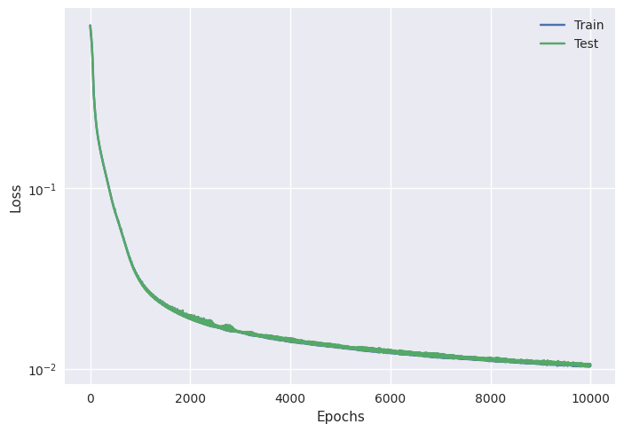
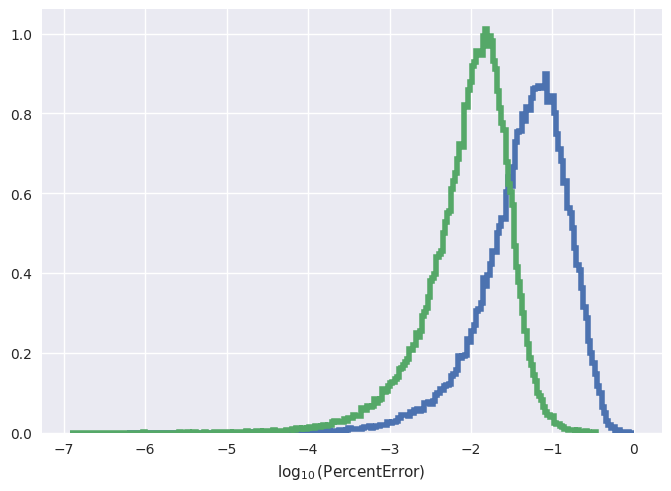
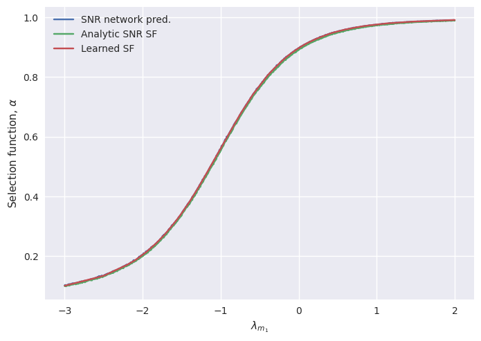

.. code:: ipython3

    from poplar.distributions import VariableLimitsPowerLaw, FixedLimitsPowerLaw, UniformDistribution
    from poplar.nn.networks import LinearModel
    from poplar.nn.training import train, train_test_split
    from poplar.nn.rescaling import ZScoreRescaler
    from poplar.nn.plot import loss_plot
    from poplar.selection import selection_function_from_optimal_snr
    import matplotlib.pyplot as plt
    import numpy as np
    import torch
    import tqdm
    
    %load_ext autoreload
    %autoreload 2
    
    device = "cuda:1"

.. parsed-literal::

    The autoreload extension is already loaded. To reload it, use:
      %reload_ext autoreload

In this example, we’re going to learn an analytic SNR function and use
it to model selection effects for a population of gravitational wave
signals from compact binary coalescences.

In reality, the SNR function is not analytic but our approach would be
valid nonetheless.

Learning signal detectability
-----------------------------

Firstly, let’s define an SNR function. We’re going to focus on a few
parameters: the masses :math:`(m_1, m_2)` of the compact objects, the
luminosity distance to the binary :math:`d_L` (in some arbitrary units)
and a trigonometric function of two “sky position angles”
:math:`(\alpha, \delta)`. We define the optimal SNR :math:`\rho` as

.. math::  \rho = \frac{1}{d_L} \mathcal{M_c}^{2.2} f(\alpha, \delta)

where :math:`\mathcal{M_c}` is the chirp mass of the binary, defined as

.. math::  \mathcal{M_c} = \frac{(m_1m_2)^{3/5}}{(m_1 + m_2)^{1/5}} 

and

.. math::  f(\alpha, \delta) = -(1 + \cos^2(2\alpha/3) - \sin^2(5\delta/3))\cos(5\alpha/6)\sin(4\delta/3)

Let’s define these functions and visualise the form of :math:`f`:

.. code:: ipython3

    def dummy_antenna_pattern(a, d):
        return 1 + (np.cos(2*a/3)**2 - np.sin(5*d/3)**2)*np.cos(5*a/6)*np.cos(4*d/3)
    
    def mchirp(m1, m2):
        return (m1 * m2)**(3/5) / (m1 + m2)**(1/5)
    
    def snr(m1, m2, dL, alpha, delta):
        return 1/dL * mchirp(m1, m2)**2.2 * dummy_antenna_pattern(alpha, delta)
    
    av, dv = np.meshgrid(np.linspace(0,2*np.pi), np.linspace(0, np.pi))
    Z = dummy_antenna_pattern(av, dv)
    plt.pcolormesh(av, dv, Z)
    plt.colorbar()

.. parsed-literal::

    <matplotlib.colorbar.Colorbar at 0x7f57bae039d0>

.. image:: end_to_end_example_files/end_to_end_example_3_1.png

We’re going to consider masses in the range [1, 100] :math:`M_\odot`,
angles in the range :math:`[0, 2 \pi]` and :math:`[0, \pi]` for
:math:`\alpha` and :math:`\delta` respectively and :math:`d_L` in the
range :math:`[0.01, 1]` (in some arbitrary units).

Let’s generate a dataset of SNRs in this prior range, and our neural
network to be trained on these SNRs. As SNR scales inversely with
luminosity distance (which is obviously true for our analytic example,
but is also true in general), we can factorise this out and train on the
remaining parameters. To ensure that the network output is positive
definite, we train on :math:`\log(\rho)`.

.. code:: ipython3

    n_train = int(1e6)  # number of training examples
    
    # sample from our priors
    m1 = np.random.uniform(1, 100, n_train)
    m2 = np.random.uniform(1, 100, n_train)
    dL = np.random.uniform(0.01, 1, n_train)
    alpha = np.random.uniform(0, 2*np.pi, n_train)
    delta = np.random.uniform(0, np.pi, n_train)
    
    true_snrs = snr(m1, m2, dL , alpha, delta)
    xdata = torch.as_tensor(np.vstack((m1, m2, alpha, delta)).T, device=device).float()
    ydata = torch.as_tensor(true_snrs * dL, device=device).float()

.. code:: ipython3

    # define a rescaler, which handles the scaling of input data to facilitate training
    rescaler = ZScoreRescaler(xdata, ydata, yfunctions=[torch.log, torch.exp])

.. code:: ipython3

    # define the neural network
    model = LinearModel(
        in_features=4,
        out_features=1,
        neurons=[128, 128, 128, 128],
        activation=torch.nn.ReLU,
        rescaler=rescaler
    )   
    
    model.to(device)

.. parsed-literal::

    LinearModel(
      (layers): Sequential(
        (0): Linear(in_features=4, out_features=128, bias=True)
        (1): ReLU()
        (2): Linear(in_features=128, out_features=128, bias=True)
        (3): ReLU()
        (4): Linear(in_features=128, out_features=128, bias=True)
        (5): ReLU()
        (6): Linear(in_features=128, out_features=128, bias=True)
        (7): ReLU()
        (8): Linear(in_features=128, out_features=1, bias=True)
      )
    )

.. code:: ipython3

    train_up_to = int(0.9 * n_train)
    xtrain, xtest, ytrain, ytest = train_test_split([xdata, ydata], 0.9)
    optimiser = torch.optim.Adam(model.parameters(), lr=1e-4)

.. code:: ipython3

    train(
        model, 
        data=[xtrain, ytrain, xtest, ytest], 
        n_epochs=10000, 
        n_batches=1, 
        loss_function=torch.nn.L1Loss(),
        optimiser=optimiser,
        update_every=1000,
        verbose=True,
    )

.. parsed-literal::

    Epoch: 9999 | Train loss: 1.041e-02 | Test loss: 1.047e-02 (Lowest: 1.035e-02)
    Training complete - saving.

.. code:: ipython3

    with plt.style.context("seaborn"):
        loss_plot(model.loss_curves[0], model.loss_curves[1])

The model has trained well (but could be improved with some iterative
adjustment of training settings).

We can plot a histogram of the performance of the network on the
validation set to see how well it has trained.

.. code:: ipython3

    ypred = model.run_on_dataset(xtest)
    
    with plt.style.context("seaborn"):
        plt.hist(np.log10(abs((1 - ypred/ytest).cpu().numpy())), bins='auto', density=True)
        plt.xlabel(r'$\log_{10}(\mathrm{Percent Error})$')
    plt.show()

.. image:: end_to_end_example_files/end_to_end_example_12_0.png

Estimating the Selection Function
=================================

We’re now ready to use this model to predict the detectability of a
distribution of these events. We’ll consider a distribution where we
parameterise the mass distributions as powerlaws with slope
:math:`\lambda = -2` and limits :math:`[1, 100]M_\odot`. Events will be
distributed uniformly on the sky, and luminosity distance will scale
with a power law of slope :math:`\lambda = -3` (as one would expect for
a volumetric distribution).

Detectability is evaluated by comparing the optimal SNR of each event
with a pre-defined threshold :math:`\rho_t`. The fraction of the
population that is detectable (known as the selection function) is

.. math::  \alpha = 1 - \Phi_{\chi^2}(\rho| k=N_\mathrm{det}, n=\rho_t)

\ where :math:`\Phi_{\chi^2}` is the CDF of the non-central chi-square
distribution with degrees of freedom :math:`k` and non-centrality
parameter :math:`n`. :math:`N_\mathrm{det}` is the number of detectors
in the observing network.

In this somewhat arbitrary case, we’ll use a threshold of :math:`20` and
assume a network of two detectors was used to observe all of the events.

.. code:: ipython3

    # set up distributions
    distributions = {
        "m1": VariableLimitsPowerLaw([1,100], device=device),
        "m2": FixedLimitsPowerLaw([1,100], device=device),
        "dL": FixedLimitsPowerLaw([0.01,1], device=device),
        "alpha": UniformDistribution([0, 2*np.pi], device=device),
        "delta": UniformDistribution([0, np.pi], device=device)
    }
    
    #Population distribution class for ease of evaluating PDF and drawing points
    class PopulationDistribution:
        def __init__(self, distributions, data) -> None:
            self.distributions = distributions
            self.data = data
    
        def pdf(self, x):
            m1params = x['m1']
            return self.distributions['m1'].pdf(self.data['m1'], m1params['lam'], m1params['xlow'], m1params['xhigh'])
    
        def draw_samples(self, x, size):
            out = {}
            for key in self.distributions.keys():
                out[key] = self.distributions[key].draw_samples(**x[key], size=size)
            return out
    
    popdist = PopulationDistribution(distributions=distributions, data=None)

.. code:: ipython3

    true_x = {
        "m1": {"lam": -2, "xlow": 1, "xhigh": 100},
        "m2": {"lam": -2},
        "dL": {"lam": 3},
        "alpha": {},
        "delta": {},
    }
    
    catalogue = popdist.draw_samples(true_x, size=int(1e5))

.. code:: ipython3

    catalogue_snrs = model.run_on_dataset(torch.vstack([catalogue['m1'],catalogue['m2'],catalogue['alpha'],catalogue['delta']]).T, luminosity_distances=catalogue['dL'])
    numpy_catalogue = {cat_label: cat_samples.cpu().numpy() for cat_label, cat_samples in catalogue.items()}
    true_snrs = snr(**numpy_catalogue)

.. code:: ipython3

    with plt.style.context("seaborn"):
        plt.hist(np.log10(abs((1 - catalogue_snrs.cpu().numpy()/true_snrs))), bins='auto', density=True, histtype='step', lw=4)
        plt.hist(np.log10(abs((1 - ypred/ytest).cpu().numpy())), bins='auto', density=True, histtype='step', lw=4)
        plt.xlabel(r'$\log_{10}(\mathrm{Percent Error})$')
    plt.show()

.. code:: ipython3

    predicted_alpha = selection_function_from_optimal_snr(catalogue_snrs, 20, number_of_detectors=2)
    true_alpha = selection_function_from_optimal_snr(torch.as_tensor(true_snrs, device=device), 20, number_of_detectors=2)
    
    print(predicted_alpha.item(), true_alpha.item())

.. parsed-literal::

    0.20161382048296292 0.19815006956499392

We are capable of estimating the selection function using our SNR
network in this way, but we can make some further improvements by
introducing a second network into the mix: one that is trained on
*selection function estimates*. The training dataset for this network
would be expensive to produce for a realistic scenario, but our SNR
network allows us to bypass this cost and produce the dataset quickly.

Let’s illustrate this with a one-dimensional example, where we
investigate how varying :math:`\lambda_{m_1}` affects the population
detectability.

.. code:: ipython3

    lambda_m1s = np.random.uniform(-3, 2, int(1e3))
    selection_functions = []
    true_selection_functions = []
    
    for lam_m1 in tqdm.tqdm(lambda_m1s):
        true_x['m1']['lam'] = torch.as_tensor(lam_m1).float()
        catalogue = popdist.draw_samples(true_x, size=int(1e5))
        numpy_catalogue = {cat_label: cat_samples.cpu().numpy() for cat_label, cat_samples in catalogue.items()}
        true_snrs = snr(**numpy_catalogue)
        catalogue_snrs = model.run_on_dataset(torch.vstack([catalogue['m1'],catalogue['m2'],catalogue['alpha'],catalogue['delta']]).T, luminosity_distances=catalogue['dL'])
        selection_functions.append(selection_function_from_optimal_snr(catalogue_snrs, 20, number_of_detectors=2))
        true_selection_functions.append(selection_function_from_optimal_snr(true_snrs, 20, number_of_detectors=2))

.. parsed-literal::

    100%|██████████| 1000/1000 [02:53<00:00,  5.76it/s]

.. code:: ipython3

    sel_xdata = torch.as_tensor(lambda_m1s, device=device)[:,None].float()
    sel_ydata = torch.as_tensor(selection_functions, device=device).float()
    
    rescaler2 = ZScoreRescaler(sel_xdata, sel_ydata)
    
    selection_function_model = LinearModel(
        1,
        1,
        [128, 128, 128],
        activation=torch.nn.ReLU,
        rescaler=rescaler2
    )
    
    selection_function_model.to(device)
    
    sel_xtrain, sel_xtest, sel_ytrain, sel_ytest = train_test_split([sel_xdata, sel_ydata], 0.9)
    
    train(
        selection_function_model, 
        [sel_xtrain, sel_ytrain, sel_xtest, sel_ytest], 
        n_epochs=1000, 
        n_batches=1,
        optimiser = torch.optim.Adam(selection_function_model.parameters(), lr=1e-4),
        loss_function=torch.nn.L1Loss(),
        update_every=1000,
        verbose=True)

.. parsed-literal::

    Epoch: 999 | Train loss: 2.507e-03 | Test loss: 2.341e-03 (Lowest: 2.162e-03)
    Training complete - saving.

.. code:: ipython3

    with plt.style.context("seaborn"):
        loss_plot(selection_function_model.loss_curves[0], selection_function_model.loss_curves[1])

.. image:: end_to_end_example_files/end_to_end_example_22_0.png

.. code:: ipython3

    lambda_m1_testvec = torch.linspace(-3, 2, int(1e3), device=device)[:,None]
    sel_pred = selection_function_model.run_on_dataset(lambda_m1_testvec)

.. code:: ipython3

    sort_inds = np.argsort(lambda_m1s)
    with plt.style.context("seaborn"):
        plt.plot(lambda_m1s[sort_inds], torch.as_tensor(selection_functions).numpy()[sort_inds], label='SNR network pred.')
        plt.plot(lambda_m1s[sort_inds], np.array(true_selection_functions)[sort_inds], label='Analytic SNR SF')
        plt.plot(lambda_m1_testvec.cpu().numpy(), sel_pred.cpu().numpy(), label='Learned SF')
        plt.legend()
        plt.ylabel(r'Selection function, $\alpha$')
        plt.xlabel(r'$\lambda_{m_1}$')
        plt.legend()
    plt.show()

This trained selection function network is now ready to be used in
population inference to deliver rapid estimates of the selection
function at low additional computational cost.

TODO: Add 1d population inference example
